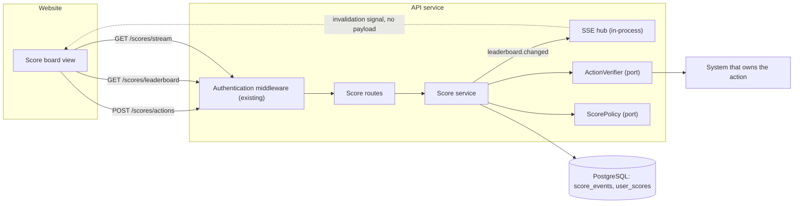
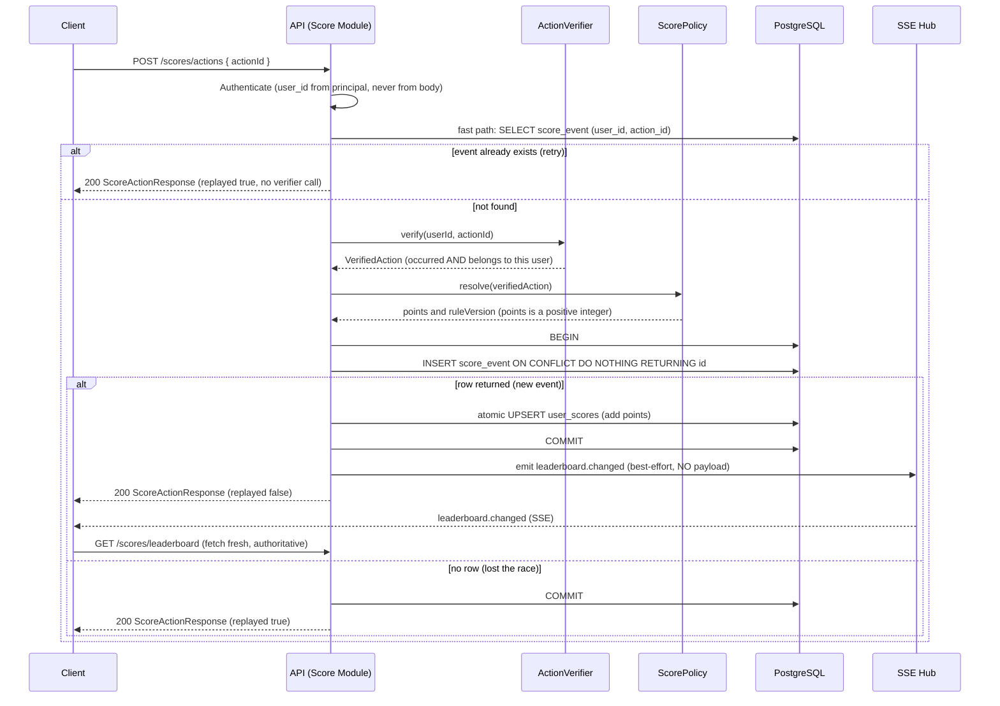
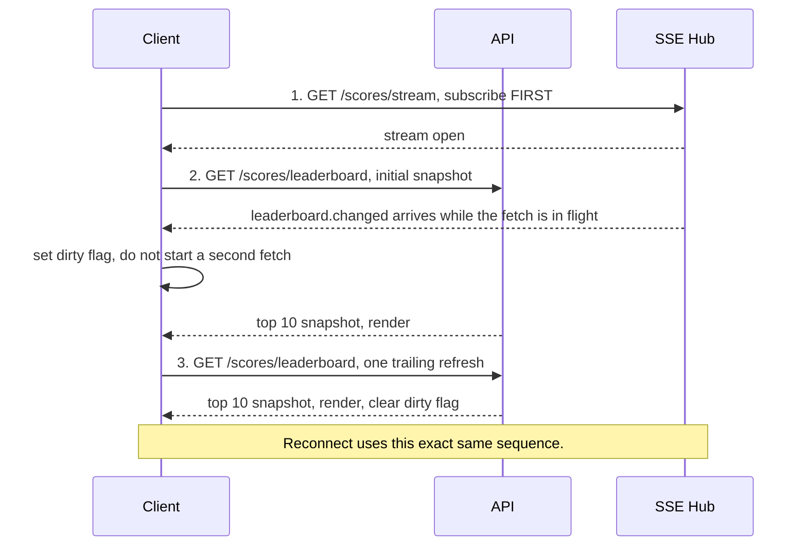

# Score Module — Specification

A module of the existing API service (backend application server). It owns the user score aggregate, the top-10 leaderboard read model, and the live-update signal that keeps the website's score board current.

This document is the handover artifact for the backend engineering team. It fixes the data model, the HTTP contract, the concurrency strategy, the failure behaviour and the acceptance criteria. Where the brief is silent, the decision is stated here and recorded as an assumption in section 11 — there is no open question left for the implementing team to resolve by guessing.

**Reading order:** section 3 for what must be built, sections 4-6 for how, section 7 for why it cannot be cheated, section 10 for when it is done.

| Section | Contents |
|---|---|
| 1 | Overview & Scope |
| 2 | Glossary |
| 3 | Requirements (functional, non-functional) |
| 4 | Data Model |
| 5 | API Specification |
| 6 | Execution Flow |
| 7 | Security & Anti-Abuse |
| 8 | Live Update Delivery |
| 9 | Failure Modes & Recovery |
| 10 | Acceptance Criteria |
| 11 | Out of Scope & Assumptions |
| 12 | Improvements (additional comments for improvement) |

---

## 1. Overview & Scope

### 1.1 Purpose

The website shows a score board with the top 10 user scores. When a user completes an action, the client dispatches one API call; the server decides whether that action is real, how many points it is worth, records it, and updates the aggregate. Connected boards learn that the leaderboard changed and re-read it.

### 1.2 In scope

- Recording a score-increasing event for an authenticated user, exactly once per action, from a request that contains no score.
- Maintaining `user_scores` as a derived aggregate that can be rebuilt from the event log bit-exactly.
- Serving a deterministic top-10 leaderboard.
- Publishing a live-update signal over Server-Sent Events (SSE) and describing the client contract that consumes it.
- Two extension points behind interfaces: `ActionVerifier` (does this action exist, is it complete, is it this user's?), which the system that owns the action implements and this module only consumes; and `ScorePolicy` (how many points is it worth?), which this module implements and this team delivers.

### 1.3 Not in scope — the three boundaries that shape the design

Three ownership boundaries decide most of what follows, so they are stated here rather than at the end. **The action** belongs to the system that owns it: this module never learns what an action is, only that a verifier confirmed one. **Authentication** belongs to the host application: this module consumes a principal and issues no credential. **The web client** belongs to the web team: section 8.4 is a contract they must honour, not code this module ships.

Section 11.1 is the exhaustive out-of-scope list, and section 11.2 records the assumptions that go with it.

### 1.4 Component view



### 1.5 Suggested module layout

Non-binding, but it is the layering the rest of this document assumes: routes validate and delegate, the service owns the transaction, data access holds no business rules, and both extension points are injected as interfaces.

```text
score/
  routes/     HTTP surface. Schema validation, then delegate. No business logic.
  service/    Orchestration: fast path, verifier, policy, transaction, signal.
  data/       score_events and user_scores access. No business rules.
  ports/      ActionVerifier, ScorePolicy - interfaces, injected at composition.
  stream/     SSE hub: subscription registry, coalescing, heartbeat.
  migrations/ Schema for both tables and the leaderboard index.
```

### 1.6 Runtime assumptions

Node.js with TypeScript on the existing Express service, PostgreSQL as the existing relational store, and the host application's existing authentication. The module introduces no new infrastructure component: the SSE hub is in-process and the baseline targets a single API deployment. Horizontal fan-out is addressed in section 12.

---

## 2. Glossary

| Term | Meaning in this specification |
|---|---|
| **Action** | A unit of work a user completes elsewhere in the product. Its nature is irrelevant to this module; it is identified by an `actionId`. |
| **`actionId`** | Opaque identifier of one completed action, issued by the system that owns the action. Assumed unique per user (section 11). |
| **`action_type`** | Opaque classification of an action, supplied by the verifier. The module never interprets it; `ScorePolicy` maps it to points and audit reads it back. |
| **Score event** | An immutable row in `score_events` recording that one action awarded points to one user. Append-only: never updated, never deleted. |
| **Points** | The positive integer a single action contributes. Chosen by `ScorePolicy` on the server, never supplied by the client. |
| **`ruleVersion`** | Identifier of the `ScorePolicy` mapping in force when the event was recorded. Persisted so that changing the rules later never rewrites history. |
| **Total score** | The sum of `points_awarded` over all of a user's score events. Materialised in `user_scores.total_score`. |
| **Read model** | `user_scores`. Derived state, existing only to make the leaderboard read fast. Reconstructible from `score_events` at any time. |
| **Leaderboard** | The top 10 rows of `user_scores` under the ordering `total_score DESC, user_id ASC`. |
| **Replay** | A repeat request for an action that already has a score event. It returns success and awards nothing. |
| **Invalidation signal** | The `leaderboard.changed` SSE event. It carries no data; it means "re-read the leaderboard". |
| **Correlation id** | Per-request identifier carried in `X-Request-Id`, echoed on responses, present in every log line and in every error body. |
| **Principal** | The authenticated identity of the caller, supplied by the host application. `user_id` is always taken from it. |

---

## 3. Requirements

### 3.1 Functional requirements

One row per software requirement in the brief, mapped to the mechanism that satisfies it and the section that specifies it in full.

| # | Requirement | Mechanism | Specified in |
|---|---|---|---|
| **SR-1** | The website shows a score board with the **top 10 user scores** | `GET /scores/leaderboard` returns exactly the top 10 rows of `user_scores`, ordered `total_score DESC, user_id ASC`. No query parameter; the endpoint has one behaviour. Fewer than ten scored users means fewer rows, never padding. | 5.3, 4.4 |
| **SR-2** | The score board updates **live** | `GET /scores/stream` (SSE) emits `leaderboard.changed` once score events commit, coalesced per 8.3 so that a burst may produce one signal. The signal carries no payload; the client re-reads `GET /scores/leaderboard`, so the database is always the source of truth. Polling is the documented fallback. | 8 |
| **SR-3** | Completing an **action increases the user's score** | The server records an immutable score event with `points_awarded` from `ScorePolicy` (`points > 0`), then applies an atomic `total_score = total_score + points` upsert on `user_scores`. | 4, 6, 7.4 |
| **SR-4** | Completion **dispatches an API call** to update the score | `POST /scores/actions` with body `{ "actionId": "..." }`. One call, idempotent under retry, returning the same response shape on both the first-write and the replay branch. | 5.2, 6 |
| **SR-5** | **Prevent malicious users from increasing scores without authorisation** | Layered: identity from the authenticated principal only; no score in the request; `ActionVerifier` proves the action occurred **and** belongs to this user; `UNIQUE(user_id, action_id)` makes replay worthless; append-only event log gives an audit trail; rate limiting bounds abuse of the endpoint. | 7 |

### 3.2 Non-functional requirements

Traffic volume is unspecified by the brief. The baseline targets a single API deployment and prioritises correctness. Capacity and refresh-frequency targets must be established through load testing against actual expected traffic; this specification deliberately states no capacity, throughput or latency figure, because a number invented here would silently become a design constraint. The coalescing interval of section 8 and the heartbeat interval are operational tuning knobs for the same reason. Horizontal fan-out is covered in section 12.

| Attribute | Requirement |
|---|---|
| **Correctness first** | Where correctness and freshness conflict, correctness wins: the database is authoritative and every client read goes to it. |
| **Idempotency** | Retrying `POST /scores/actions` is always safe, including after a client timeout or a server crash, and including while `ActionVerifier` is unavailable. |
| **Determinism** | Identical stored data yields an identical leaderboard response. Ordering never depends on a clock, on insertion order, or on the query plan. |
| **Auditability** | Every awarded point traces to one immutable event carrying its `points_awarded` and `rule_version`. Score history is never rewritten. |
| **Observability** | Every request carries a correlation id, taken from the `X-Request-Id` request header when present and generated when absent. Logs are structured JSON, one object per line, always including the correlation id, the route, the outcome and — for `POST /scores/actions` — the `actionId` and whether the request was a replay. The error envelope returns the same id, so a user's support report maps to a log line without a search by timestamp. Points values and identifiers are logged; credentials and tokens never are. |
| **Recoverability** | The read model can be rebuilt from the event log at any time (4.5). The repair runs while the service serves traffic; writes that commit during it are picked up by the next run, and a rebuild that must be exact as of a point in time truncates the table first. |
| **Portability** | No new infrastructure dependency. PostgreSQL and the existing Express service only. |
| **Security posture** | Fail closed. Any uncertainty about identity, ownership or policy results in no score change. |
| **Backwards compatibility** | `rule_version` allows the points mapping to change without invalidating history or requiring a migration of past events. |

---

## 4. Data Model

### 4.1 Schema

```sql
CREATE TABLE score_events (              -- append-only: never UPDATE, never DELETE
  id             UUID PRIMARY KEY,
  user_id        UUID        NOT NULL,
  action_id      VARCHAR(64) NOT NULL,
  action_type    VARCHAR(32) NOT NULL,
  points_awarded INTEGER     NOT NULL CHECK (points_awarded > 0),
  rule_version   INTEGER     NOT NULL,
  occurred_at    TIMESTAMPTZ NOT NULL,   -- factual event time, from the verifier
  created_at     TIMESTAMPTZ NOT NULL,   -- server processing time
  CONSTRAINT uq_user_action UNIQUE (user_id, action_id)
);

CREATE TABLE user_scores (               -- read model, rebuilt BIT-EXACT from events
  user_id     UUID PRIMARY KEY,
  total_score BIGINT NOT NULL DEFAULT 0  -- wire type is STRING, see 5.1
);

-- Serves the module's hottest query: it matches the leaderboard ORDER BY exactly,
-- so PostgreSQL reads the top 10 straight from the index instead of scanning and
-- sorting. A read model exists to be read fast; it must carry its read index.
CREATE INDEX ix_leaderboard ON user_scores (total_score DESC, user_id ASC);
```

`user_scores` has exactly two columns. It carries **no timestamp column of any kind**: the read model holds only business state derivable from the event log, so a rebuild tomorrow must produce a table identical to the one rebuilt today. An operational timestamp, if operations ever needs one, is not business state and does not belong in this table.

Storing `action_type` does not contradict the module's indifference to what the action is: the module never interprets the value. It is an opaque key that `ScorePolicy` maps to points and that audit reads back when explaining a total.

No separate index is needed for the idempotency lookup: `uq_user_action` already serves the `(user_id, action_id)` equality probe of the fast path in section 6.

Both tables are created by a versioned migration owned by this module, with a matching `down`. Identifiers are UUIDs generated by the application.

### 4.2 Why `points_awarded` and `rule_version` are persisted

The points value in force at the time of the action is a historical fact. If the policy later changes an action type from one value to another, a rebuild of `user_scores` must reproduce the totals users actually had — recomputing history against today's rules would silently restate every past score. Persisting both the awarded amount and the version of the rule that produced it makes the event log self-contained, and makes "why does this user have this score" answerable from one table.

### 4.3 Integrity rules

| Rule | Enforcement |
|---|---|
| One score event per user per action | `uq_user_action UNIQUE (user_id, action_id)` |
| Points always increase the score | `CHECK (points_awarded > 0)`, plus the `ScorePolicy` invariants in 7.4 |
| `points_awarded` fits `INTEGER` | `ScorePolicy` invariant: safe integer, greater than zero, within the 32-bit signed range. A value outside it is a policy defect, not a request error. |
| History is immutable | Application code issues no `UPDATE` or `DELETE` against `score_events`. Recommended: revoke `UPDATE` and `DELETE` on that table from the application database role. |
| The read model is derived | Only this module writes `user_scores`, and only through the atomic upsert of section 6. |
| Totals may exceed the JavaScript safe-integer range | `total_score` is `BIGINT`; the driver returns it as a string and the boundary keeps it a string. It is never passed through `Number`. |

### 4.4 Leaderboard query and tie-breaking

```sql
SELECT user_id, total_score
FROM user_scores
ORDER BY total_score DESC, user_id ASC
LIMIT 10;
```

Ties are resolved by `user_id ASC`. This makes the ordering total and fully deterministic without introducing a business rule the brief does not ask for, and without any clock semantics in the read model. Two users on the same total therefore always appear in the same relative order, in every response and after every rebuild.

### 4.5 Rebuilding the read model

Two statements, run together in one transaction:

```sql
-- 1. Recompute every total from the log.
INSERT INTO user_scores (user_id, total_score)
SELECT user_id, SUM(points_awarded)
FROM score_events
GROUP BY user_id
ON CONFLICT (user_id) DO UPDATE
  SET total_score = EXCLUDED.total_score;

-- 2. Drop rows for users the log knows nothing about. The upsert alone updates
--    and inserts but never deletes, so without this step an orphan row survives
--    the repair and section 9 keeps reporting it.
DELETE FROM user_scores u
WHERE NOT EXISTS (SELECT 1 FROM score_events e WHERE e.user_id = u.user_id);
```

Because `user_scores` holds nothing but `user_id` and `total_score`, the pair reproduces the table from the log alone: there is no clock-derived column a rebuild could not reproduce. Writes that commit while the two statements run are simply picked up by the next run; a rebuild that must be exact as of a point in time truncates `user_scores` first and then runs statement 1. Drift detection and the operational procedure are in section 9.

---

## 5. API Specification

Three endpoints, and no more.

| Method | Path | Purpose | Authentication |
|---|---|---|---|
| `POST` | `/scores/actions` | Report one completed action; the server scores it | Required, always |
| `GET` | `/scores/leaderboard` | Read the top 10 | Per the read-access assumption, 11.2 |
| `GET` | `/scores/stream` | Subscribe to the invalidation signal | Same as the leaderboard, 7.6 |

### 5.1 Conventions common to all three

- **Identity.** `user_id` is taken from the authenticated principal only. No route ever reads a user identifier from the body, the query string or a client-controlled header.
- **Validation.** Request bodies are validated against a strict schema before the handler runs; unknown properties are rejected rather than ignored.
- **Correlation id.** Each request is assigned an id, taken from `X-Request-Id` when the caller supplies a well-formed one and generated otherwise. A caller cannot inject arbitrary content into the log line by way of the header. It is echoed in the `X-Request-Id` response header, included in every log line for that request, and returned in the body of every error.
- **Error envelope.** Every non-2xx JSON response carries `error` and `requestId`. The `details` key is **omitted** — not set to `null` — unless it adds actionable information, and it never carries internal diagnostics.

  ```json
  { "error": "action_not_verified", "requestId": "0f3f0f8e-6f2c-4f0c-9b3a-1f2e5a7c9d10" }
  ```

  ```json
  {
    "error": "validation_error",
    "requestId": "0f3f0f8e-6f2c-4f0c-9b3a-1f2e5a7c9d10",
    "details": { "field": "actionId", "reason": "does not match the required pattern" }
  }
  ```

- **Numeric types on the wire.** `pointsAwarded` is a JSON number (it is an `INTEGER` and always safe). `totalScore` and `currentTotalScore` are JSON **strings**: the storage type is `BIGINT`, the brief gives no upper bound, and the PostgreSQL driver deliberately returns `int8` as a string. The value is kept exact at the JavaScript boundary and is never passed through `Number`.

**Error codes used by the module**

| Code | Status | When |
|---|---|---|
| `validation_error` | 400 | The body or path fails the schema: missing `actionId`, wrong type, wrong length, disallowed characters, or any unknown property. |
| `unauthenticated` | 401 | Credentials are missing, malformed or expired. |
| `forbidden` | 403 | The principal is authenticated but lacks the required scope — for example a subscription token presented to `POST /scores/actions`. |
| `action_not_verified` | 422 | `ActionVerifier` did not confirm the action. Deliberately one code for "unknown action", "not completed" and "belongs to another user", so probing cannot distinguish them. |
| `rate_limited` | 429 | The principal exceeded the configured request budget. Carries `Retry-After`. |
| `internal_error` | 500 | Unexpected failure, including a `ScorePolicy` invariant violation. No score change occurred. |
| `verifier_unavailable` | 503 | `ActionVerifier` is temporarily unreachable. Carries `Retry-After`; retrying the same `actionId` is safe. |

### 5.2 `POST /scores/actions`

Called by the client immediately after the user completes an action.

**Request**

```http
POST /scores/actions
Content-Type: application/json
Authorization: Bearer <access token>
X-Request-Id: 0f3f0f8e-6f2c-4f0c-9b3a-1f2e5a7c9d10

{ "actionId": "a3f1c2d4-5e6f-4a8b-9c0d-1e2f3a4b5c6d" }
```

| Field | Type | Rules |
|---|---|---|
| `actionId` | string | Required. Matches `^[A-Za-z0-9_.:-]{1,64}$` — a conservative allow-list that admits UUID, ULID and URL-safe base64 identifiers, bounded to the width of `score_events.action_id VARCHAR(64)`. The owning system chooses the format; the module only bounds it, so that an over-long or exotic value fails as a `400` here rather than as a driver error at the insert. |

The body has exactly one property. The client never sends, and the server never accepts, a points or score value in any form: the schema is strict, so a body carrying any additional property is rejected with `400 validation_error` regardless of what that property is called. This is the first line of SR-5 — there is no field for a malicious client to inflate.

**Response — `200 OK`, one shape for both branches**

```ts
type ScoreActionResponse = {
  actionId: string;
  pointsAwarded: number;     // from the stored score event
  currentTotalScore: string; // BIGINT rendered as a string at the boundary
  replayed: boolean;         // true on the fast-path and duplicate branches
};
```

```json
{
  "actionId": "a3f1c2d4-5e6f-4a8b-9c0d-1e2f3a4b5c6d",
  "pointsAwarded": 10,
  "currentTotalScore": "1270",
  "replayed": false
}
```

Field semantics, which are identical on both branches:

- `pointsAwarded` is the value stored on the score event for this `(user_id, actionId)` — the amount recorded when that event was first written. On the replay branch it is read back from `score_events`.
- `currentTotalScore` is the user's total **as it stands now**, read from `user_scores`. It is not a snapshot of the total at the moment the event was first recorded, and the module never stores one: if action A awarded points and action B awarded more afterwards, a retry of A reports the total including B. Reporting current state is the defined semantics of this field.
- `replayed` is `false` when this call inserted the score event, `true` when the event already existed.

Both branches return `200`. A repeat is not an error and must not be distinguishable by status code, so the client needs no branching to handle its own retries; `replayed` exists for telemetry and for the rare UI that wants to suppress a celebratory animation on a retry.

**Status codes**

| Status | Meaning |
|---|---|
| 200 | Recorded, or already recorded. `replayed` says which. |
| 400 | `validation_error` |
| 401 | `unauthenticated` |
| 403 | `forbidden` |
| 422 | `action_not_verified` |
| 429 | `rate_limited` |
| 500 | `internal_error` |
| 503 | `verifier_unavailable` |

### 5.3 `GET /scores/leaderboard`

**Request**

```http
GET /scores/leaderboard
Authorization: Bearer <access token>
```

The endpoint takes **no query parameters**. It always returns the top 10. Any query string a caller appends is ignored, and the response never varies as a result. Page size, offset, ranges and "since" filters are outside the required behaviour; adding them would create ordering and pagination semantics that no requirement needs.

**Response — `200 OK`**

```json
{
  "leaderboard": [
    { "rank": 1, "userId": "8f14e45f-ceea-467a-9f9f-4a1a7d0b6a11", "totalScore": "4820" },
    { "rank": 2, "userId": "1c383cd3-0b7c-4a51-9f9d-33c1c5cf4e0a", "totalScore": "4820" },
    { "rank": 3, "userId": "aab32389-22b1-4c62-8b03-59b2d3e7f0c2", "totalScore": "3110" }
  ]
}
```

| Field | Type | Meaning |
|---|---|---|
| `rank` | number | 1-based position in the returned ordering. Because the ordering is total, ranks are distinct: two users on the same `totalScore` occupy consecutive ranks, ordered by `user_id ASC`. |
| `userId` | string | UUID. Display names are resolved by the caller. |
| `totalScore` | string | Exact `BIGINT` value. |

- At most 10 entries; fewer when fewer users have a score. The array is never padded and is empty when no user has scored.
- Backed verbatim by the query in 4.4, which is served by `ix_leaderboard`.
- `Cache-Control: no-store`. This response is the authoritative read that follows an invalidation signal; a cached copy would defeat the live update.
- Errors: `401 unauthenticated` when read access is authenticated (11.2), `429 rate_limited`, `500 internal_error`.

### 5.4 `GET /scores/stream`

A Server-Sent Events stream carrying the invalidation signal. Rationale, coalescing and the client bootstrap contract are in section 8; authentication is in 7.6.

**Request**

```http
GET /scores/stream
Accept: text/event-stream
Cookie: <same-origin session cookie>
```

The stream carries the same-origin session cookie by default. A bearer-only deployment presents a narrow subscription token in the query string instead — `GET /scores/stream?subscription_token=...` — never the primary access token. Rationale and reconnect consequences: 7.6.

**Response — `200 OK`**

```http
Content-Type: text/event-stream
Cache-Control: no-store
Connection: keep-alive
X-Accel-Buffering: no
```

`X-Accel-Buffering: no` is required whenever a buffering reverse proxy sits in front of the service; without it the proxy accumulates the stream and the "live" update arrives in bursts.

**Wire format**

```text
event: leaderboard.changed
data: 1

: keep-alive

```

- The only event type is `leaderboard.changed`. It means "the leaderboard may have changed; re-read it". It carries no information about what changed, who changed it, or by how much.
- The `data` line is a placeholder required by the SSE wire format — a message with an empty data buffer is not dispatched to `EventSource` listeners at all. Clients must ignore its content, and the server must never begin putting meaningful data there.
- Lines beginning with `:` are comments used as heartbeats, sent periodically so idle intermediaries do not drop the connection. The interval is an operational setting.
- The server may send a `retry:` field to set the client's reconnect delay.
- Event ids are not used and `Last-Event-ID` is ignored: the stream has no history to resume, because it carries no state. A reconnecting client re-runs the bootstrap sequence in 8.5.
- Errors before the stream opens use the normal JSON error envelope (`401 unauthenticated`, `403 forbidden`, `429 rate_limited`). Once the stream is open, failure is expressed by closing the connection; the client reconnects and bootstraps again.

---

## 6. Execution Flow

### 6.1 Sequence diagram



### 6.2 Step by step

1. **Authenticate.** Resolve the principal; `user_id` comes from it. Reject with `401` if there is no valid principal.
2. **Validate.** Parse the body against the strict schema of 5.2.
3. **Fast path.** `SELECT` from `score_events` by `(authenticated user_id, action_id)`. If a row exists, return `200` with `replayed: true`, `pointsAwarded` from that row and `currentTotalScore` read from `user_scores`. `ActionVerifier` is not called. If no `user_scores` row exists — reachable only after `user_scores` has been truncated for a rebuild (4.5) — report `currentTotalScore` as `"0"` rather than failing; the next read reflects the rebuilt total.
4. **Verify.** Call `ActionVerifier.verify({ userId, actionId })`. A rejection maps to `422 action_not_verified`; a transient dependency failure maps to `503 verifier_unavailable`. Nothing is written in either case.
5. **Resolve points.** Call `ScorePolicy.resolve(verifiedAction)` and check its invariants (7.4). A violation is a server defect: `500 internal_error`, no write.
6. **Record, in one transaction.** Insert the event idempotently; if and only if the insert produced a row, apply the atomic aggregate upsert. Commit.
7. **Signal.** After a successful commit that inserted a row, hand `leaderboard.changed` to the SSE hub. Emission is best-effort and outside the transaction; a failure to emit never fails the request.
8. **Respond.** `200` with the response of 5.2.

### 6.3 The transaction

```sql
BEGIN;

INSERT INTO score_events (id, user_id, action_id, action_type,
                          points_awarded, rule_version, occurred_at, created_at)
VALUES (:id, :userId, :actionId, :actionType,
        :points, :ruleVersion, :occurredAt, :now)
ON CONFLICT (user_id, action_id) DO NOTHING
RETURNING id;

-- Row returned: this call created the event. Apply the delta atomically.
INSERT INTO user_scores (user_id, total_score)
VALUES (:userId, :points)
ON CONFLICT (user_id) DO UPDATE
  SET total_score = user_scores.total_score + EXCLUDED.total_score;

COMMIT;
```

Where each bound value comes from:

| Parameter | Source |
|---|---|
| `:id` | Generated by the application (UUID v4) for this insert attempt. It is discarded when the insert conflicts. |
| `:userId` | The authenticated principal. Never the request body. |
| `:actionId` | The validated request field. The module also asserts that `VerifiedAction.actionId` equals it; a mismatch is a verifier contract violation and results in `500 internal_error` with no write. |
| `:actionType` | `VerifiedAction.actionType`. A value longer than the column is likewise a verifier contract violation, rejected before the insert rather than truncated by the driver. |
| `:points`, `:ruleVersion` | The `ScorePolicy` result, after its invariants are checked. |
| `:occurredAt` | `VerifiedAction.occurredAt` — the factual completion time from the owning system. |
| `:now` | The server's clock at insert time. Recorded for operations and support only: no ordering, ranking or business decision reads it. |

For the implementing team, in one line: *insert idempotently (`ON CONFLICT DO NOTHING`), update the read model with an atomic upsert (`total_score = total_score + delta`), and only when a new score event was actually inserted.*

**No row returned** means a concurrent request won the race. Commit the (empty) transaction, then read the stored event and the user's total in a fresh snapshot and return `replayed: true`. Do not add points and do not emit a signal.

Three details the implementation must not get wrong:

- **Never read-then-write the aggregate.** `SELECT total_score` followed by `UPDATE ... SET total_score = :computed` loses updates when two *different* actions of the same user commit concurrently. The upsert above is a single atomic statement and is the only sanctioned way to move `total_score`.
- **Do not catch the unique violation instead.** A unique violation aborts the PostgreSQL transaction (`25P02`), after which no further statement can run in it — including the `SELECT` needed to build the replay response. `ON CONFLICT DO NOTHING` keeps the transaction alive.
- **Read the existing event after the commit.** When the insert conflicts with a row written by a transaction that is still in flight, `ON CONFLICT DO NOTHING` waits for that transaction to finish. A no-row result therefore means the other transaction has already completed, and a read taken after our own commit — that is, in a new snapshot — sees the committed event and the updated total.

The default `READ COMMITTED` isolation level is sufficient. The correctness of both paths rests on the unique constraint and the atomic upsert, not on isolation level or on application-level locking.

### 6.4 Why both the fast path and the unique constraint exist

They solve different problems and neither replaces the other.

| Mechanism | Guarantees |
|---|---|
| Fast-path `SELECT` before the verifier | **Retry availability.** A retry after a client timeout or a crash returns `200` even while `ActionVerifier` is temporarily down. Without it, "retry is idempotent" would only hold while the verifier is healthy. |
| `UNIQUE (user_id, action_id)` | **Concurrency correctness.** Two genuinely new requests can both miss the fast-path `SELECT`; the database still admits exactly one event and no points are double-counted. |

The flow therefore covers both classes of concurrency: the same action arriving twice resolves to idempotency, and different actions arriving together resolve to no lost update.

---

## 7. Security & Anti-Abuse

### 7.1 Two principles

**Principle 1 — Server-authoritative.** The client reports an *action*; the server verifies it and computes the points itself. A bearer token or a request signature proves *who sent the request*; it proves nothing about whether the score is correct. Consequently the request carries no score, and no field of the request influences `points_awarded`.

**Principle 2 — An honest limit.** If completion of the action is known only to the client, no server-side control can distinguish a genuine completion from a fabricated claim. This module cannot fix that on its own, and it does not pretend to: it depends on `ActionVerifier`, whose implementation belongs to the system that owns the action and which must be able to confirm completion from data the client does not control. The quality of SR-5 is bounded by the quality of that implementation, and that is a property of the product, not a gap in this specification.

### 7.2 `ActionVerifier`

```ts
/**
 * Implemented by the system that owns the action. The Score Module depends only
 * on this port and never inspects the internals of an action.
 */
interface ActionVerifier {
  verify(input: { userId: string; actionId: string }): Promise<VerifiedAction>;
}

type VerifiedAction = {
  actionId: string;
  actionType: string; // maps to score_events.action_type, at most 32 characters
  occurredAt: Date;   // factual completion time, from the owning system
};
```

**The dual invariant.** A successful return asserts both of the following, and an implementation that cannot assert both must reject:

1. **The action actually occurred** — it exists and is complete in the owning system's own records, established without trusting the caller's claim.
2. **The action belongs to the authenticated user** — the `userId` passed in is the user the action is recorded against.

Part 2 is not redundant. Without it, user A can submit user B's `actionId` and the insert succeeds: `UNIQUE(user_id, action_id)` does not block it, because `(A, actionId-of-B)` is a new pair. The unique constraint prevents replay; only the ownership check prevents theft.

**Failure contract.** `verify` rejects with a typed error: `ActionNotVerifiedError` for unknown, incomplete or foreign actions, mapping to `422 action_not_verified`; `VerifierUnavailableError` for transient dependency failures, mapping to `503 verifier_unavailable`. It never returns a partially trusted result, and an implementation that returns success because the client said so defeats the entire control.

**Requirement on the owning system.** `actionId` values must be unguessable — opaque and high-entropy, not sequential — so that a caller cannot enumerate plausible identifiers and have them verified.

### 7.3 Points are not in the request

There is no code path from any request field to `points_awarded`. The route schema is strict, so an additional property is a `400`, not an ignored field; the service passes only the `VerifiedAction` to `ScorePolicy`; the insert binds `points` from the policy result. Those three points are the whole path from request to `points_awarded`.

### 7.4 `ScorePolicy`

```ts
interface ScorePolicy {
  resolve(action: VerifiedAction): { points: number; ruleVersion: number };
}
```

Invariants the module checks on every result, before any write:

- `Number.isSafeInteger(points) && points > 0`. The requirement is that an action *increases* the score; zero and negative values are rejected.
- `points` fits a 32-bit signed integer, because `score_events.points_awarded` is `INTEGER`. A wider value is a policy defect and must fail loudly rather than be truncated by the driver.
- `ruleVersion` is a positive integer, incremented whenever the mapping from action type to points changes.
- `resolve` is pure and deterministic: the same action type under the same rule version always yields the same points, and the function performs no input or output.

A violated invariant results in `500 internal_error` and no write — the module fails closed rather than recording a value it cannot justify.

Unlike `ActionVerifier`, `ScorePolicy` needs no knowledge from outside this module, so the implementing team owns it: it ships as part of this module, behind the interface, and the points table it reads is agreed with product.

The brief does not specify how many points an action awards. `ScorePolicy` isolates that decision, and the simplest valid implementation awards a fixed amount per action type from a static table, with `ruleVersion` bumped whenever that table changes.

### 7.5 Attack vectors and mitigations

| Vector | Mitigation |
|---|---|
| Client posts an inflated score | The request has no score field; the schema is strict; points come only from `ScorePolicy`. |
| Replaying a captured successful request | `UNIQUE(user_id, action_id)` plus the fast path: the repeat returns `200 replayed: true` and awards nothing. |
| Submitting another user's `actionId` | `ActionVerifier` invariant 2 (ownership). The unique constraint alone does not stop this. |
| Forging identity in the payload | `user_id` is read from the authenticated principal only; no route reads an identifier from the body, query or a client-set header. |
| Guessing or enumerating `actionId` values | Verification requires the action to exist and be complete for that user; ids must be unguessable (7.2). |
| Scripted hammering of the endpoint | Rate limiting per principal, and per source address for unauthenticated traffic; `429 rate_limited` with `Retry-After`. |
| Tampering with recorded history | `score_events` is append-only; the application issues no `UPDATE` or `DELETE`; the privilege revocation in 4.3 enforces it at the database. |
| Writing `user_scores` directly | Only this module writes the read model, and only through the atomic upsert. Any drift is detectable and repairable (section 9). |
| Leaking a credential through the SSE URL | The primary access token is never placed in a query string; the stream uses a cookie or a narrow, short-lived subscription token (7.6). |
| Harvesting the leaderboard | Governed by the read-access assumption (11.2). When reads are authenticated, they are rate limited on the same basis as writes. |

Rate limiting is a bound on abuse, not the correctness control: idempotency and verification are what make a flood of repeated requests worthless. Limits are configured per deployment.

### 7.6 Authentication of the SSE stream

`EventSource` cannot set an `Authorization` header, so the stream authenticates in this order of preference:

1. **Same-origin session cookie** with `SameSite` — the default, and the option that requires nothing new.
2. **A short-lived subscription token** when the platform is bearer-only: issued by the existing auth surface, scope `leaderboard:subscribe` and nothing else, single-use where the identity provider supports it, and short-lived — long enough to cover a page load, short enough that a leaked URL is useless, with the exact lifetime set per deployment. The primary access token is **never** used in the query string, because query strings land in access logs, proxy logs and browser history.
3. **Polling fallback** when neither is available: the client periodically calls `GET /scores/leaderboard`, which needs no new credential.

Any token presented to `/scores/stream` that carries a different scope is rejected with `403 forbidden`, and a subscription token is never accepted by `POST /scores/actions`.

**Lifetime versus a long-lived stream.** The credential is checked once, when the connection is established; it authorises the subscription, not each signal, so an open stream is not torn down when the token behind it expires. A stream that outlives its token is therefore normal and expected. The consequence is on reconnect: the browser's automatic `EventSource` reconnect would re-present the now-expired token, receive a non-2xx and close the connection permanently. When a deployment uses subscription tokens, the client must therefore handle the stream's error event itself — mint a fresh token, then open a new `EventSource` and re-run the bootstrap of 8.4. With the same-origin cookie of option 1 the browser's own reconnect is sufficient and no extra handling is needed.

### 7.7 Audit

The append-only event log is the audit trail: every point a user holds maps to one row carrying the action that produced it, the amount, the rule version, the factual event time and the server processing time. Investigating a suspicious total requires no additional tooling, and any automated control added later must not silently rewrite those rows (section 12).

---

## 8. Live Update Delivery

### 8.1 Transport choice

| Transport | Server-initiated push | Cost | Fit |
|---|---|---|---|
| **SSE** | Yes, one direction | Plain HTTP, reconnect built into `EventSource`, no protocol upgrade | **Chosen.** The board only ever receives. |
| WebSocket | Yes, both directions | Separate protocol, upgrade handling through proxies, own heartbeat and auth story | The bidirectional capability is unused; it buys complexity for nothing here. |
| Long polling | Emulated | Request churn, a connection cycle per update | Works, but SSE gives the same result with less machinery. |
| Periodic polling | No | Trivial | Kept as the documented fallback (7.6, 9). |

### 8.2 The signal carries no data

After a commit that inserted a score event, the module emits `leaderboard.changed`. The event has no payload. A client that receives it calls `GET /scores/leaderboard` and renders what the database returns.

Pushing the top 10 in the event instead would be incorrect, not merely heavier. Building a snapshot is two steps — query, then send — and those steps are not atomic. Request A commits and reads the top 10; its send is deferred by the event loop. Request B commits, reads a newer top 10 and sends it. A resumes and sends its older snapshot. The client now displays a leaderboard that has moved **backwards**, and broadcasting on every event does not fix that race — it only heals it at the next event.

Invalidation is immune to the same reordering: two `changed` signals arriving in any order are still just "re-read", and each re-read returns current state from the authoritative store. That removes the need for shared mutable state, for a mutex around the publisher, and for version numbers on the wire. Emitting only when something actually changed is likewise an optimisation the requirement does not need in order to be correct.

### 8.3 Coalescing, on both sides

Naive invalidation means one committed event causes every connected client to issue a read. The specification requires coalescing and deliberately fixes no number:

> `leaderboard.changed` notifications are coalesced on both sides — the server emits at most one signal per interval (trailing edge, batching all events in between); clients collapse concurrent signals into one trailing refresh. This is safe precisely because the signal carries no data and the database is authoritative — coalescing never loses state. The interval is an operational tuning knob set from load testing, not fixed by this specification.

Because a signal means only "state may have moved", dropping N-1 of N signals in a window costs nothing: the single read that follows returns the state produced by all N events.

### 8.4 Client contract

The web team must implement exactly this behaviour:

1. Open the SSE subscription **first**, and register the handler with `addEventListener('leaderboard.changed', ...)`. The server sends a *named* event, so an `onmessage` handler alone never fires and the board would sit silently on its initial snapshot.
2. Then issue the initial `GET /scores/leaderboard` and render the result.
3. If a signal arrives while a fetch is in flight, set a dirty flag rather than starting a second fetch; when the in-flight fetch resolves, perform one trailing refresh and clear the flag.
4. Never render leaderboard content derived from the signal itself — the signal has no content.
5. On disconnect, reconnect and repeat from step 1. Where the deployment issues subscription tokens, handle the stream's error event: obtain a fresh token and open a new `EventSource` rather than relying on automatic reconnect, which would re-present the expired one (7.6).
6. If SSE is unavailable, fall back to periodic polling of the leaderboard.

The order in steps 1-2 is mandatory. Fetching first and subscribing afterwards leaves a window between the two calls in which an update can be missed entirely, and nothing later would correct the display until the next unrelated event.

### 8.5 Bootstrap and reconnect



### 8.6 Delivery guarantees

Signal delivery is best-effort and deliberately so. The database is authoritative; the signal only shortens the time to the next read. A lost signal degrades freshness, never correctness, and the next signal or the polling fallback restores the view. Section 9 covers the crash window between commit and emission, and section 12 covers what to add if lossless delivery ever becomes a requirement.

Within a single deployment the hub is in-process. If more than one instance serves traffic before the fan-out work of section 12 is done, a client connected to an instance that did not process the write will not receive that signal; the polling fallback bounds the resulting staleness. This is stated plainly because it is the first thing to check when "the board is not live" is reported.

---

## 9. Failure Modes & Recovery

| # | Failure | Effect | Recovery |
|---|---|---|---|
| F1 | Client times out or crashes after the server committed | The client does not know whether the score was recorded | It retries the same `actionId`. The fast path returns `200 replayed: true`. No double count, and it works even while the verifier is down. |
| F2 | Server crashes between `COMMIT` and sending the response | Same as F1 from the client's view | Same as F1. The transaction boundary is the point of truth. |
| F3 | Server crashes after `COMMIT` but before emitting the signal | Connected boards do not learn about this event | The database state is authoritative; the changed-signal is best-effort after commit. On reconnect clients fetch a fresh leaderboard, and polling is the fallback. Add a transactional outbox only if lossless delivery becomes a requirement (section 12). |
| F4 | `ActionVerifier` unavailable | New actions cannot be scored | `503 verifier_unavailable` with `Retry-After`; nothing is written; retries are safe. Already-recorded actions still resolve through the fast path. |
| F5 | `ActionVerifier` rejects | The claim is not substantiated | `422 action_not_verified`, no write. Repeated rejections for one principal are a signal worth alerting on. |
| F6 | `ScorePolicy` returns a value violating an invariant | No score can be justified | `500 internal_error`, no write, error logged with the correlation id and the action type. Fail closed. |
| F7 | Two requests for the same action race | Only one may count | One insert returns a row and applies the delta; the other returns no row, commits, reads the committed event and responds `replayed: true`. |
| F8 | Two different actions of the same user commit concurrently | Both must count | The atomic upsert adds each delta; there is no read-then-write window in which an update could be lost. |
| F9 | Database unavailable | Writes and reads fail | `500 internal_error`. No partial state is possible: the event and the aggregate move in one transaction. |
| F10 | SSE connection dropped by a proxy or network | The board stops updating | `EventSource` reconnects and the client re-runs the bootstrap of 8.5, so the first render after reconnect is current. |
| F11 | Read model drift (`user_scores` disagrees with the event log) | The board shows wrong totals | Detect with the reconciliation query below; repair by running **both** statements of 4.5 — statement 1 corrects wrong totals, statement 2 removes rows for users with no events, which is exactly the drift the detector reports for a row the log does not know. Because `user_scores` holds no clock-derived state, the repair is safe to re-run. |
| F12 | A score event is later found to be invalid | The total is too high | Out of scope here, and deliberately: reversal is a product decision. Section 12 states the constraint any future control must respect — it must not silently rewrite immutable events. |

**Reconciliation query** — run on a schedule appropriate to the deployment, and after any incident affecting the write path:

```sql
SELECT COALESCE(s.user_id, e.user_id) AS user_id,
       s.total_score                  AS stored,
       e.expected                     AS expected
FROM user_scores s
FULL JOIN (
  SELECT user_id, SUM(points_awarded) AS expected
  FROM score_events
  GROUP BY user_id
) e ON e.user_id = s.user_id
WHERE s.total_score IS DISTINCT FROM e.expected;
```

An empty result means the read model is exactly the event log's projection. A non-empty result is an incident: capture the rows, then repair by running both statements of 4.5. The repair is idempotent, touches no event, and can be run while the service is serving traffic — writes committed during the repair are picked up by the next run.

---

## 10. Acceptance Criteria

Behavioural and verifiable. Each item is a test the team can write before the code exists. AC-20 and AC-21 are the criteria for the 8.4 client contract and are owned by the web team; every other criterion is server-side.

**Scoring and authorisation**

- **AC-1** A request whose body contains any property other than `actionId` is rejected with `400 validation_error`, and no row is written to either table.
- **AC-2** A request with no valid principal is rejected with `401 unauthenticated`, and no row is written.
- **AC-3** When `ActionVerifier` rejects the action, the response is `422 action_not_verified` and no row is written.
- **AC-4** When the verifier reports the action belongs to a different user, the response is identical to AC-3 — the same code, the same body shape — so the outcome cannot be used to probe for other users' actions.
- **AC-5** When `ActionVerifier` is unavailable, the response is `503 verifier_unavailable` and no row is written.
- **AC-6** When `ScorePolicy` returns a non-safe-integer, a value not greater than zero, or a value too large for the `INTEGER` column, the response is `500 internal_error` and no row is written.
- **AC-7** On success, `score_events` holds exactly one new row whose `points_awarded` and `rule_version` equal the `ScorePolicy` result, and `user_scores.total_score` has increased by exactly that amount.

**Idempotency and concurrency**

- **AC-8** Posting the same `actionId` twice in sequence returns `200` both times; the second response has `replayed: true`, `score_events` holds one row, and `total_score` moved exactly once.
- **AC-9** Two genuinely parallel requests for the same `(user, actionId)` yield the result set `{200, 200}` with exactly one `replayed: false`; the test asserts the set, never which request wins. One event row exists and `total_score` moved exactly once.
- **AC-10** Two parallel requests for two *different* actions of the same user both succeed and `total_score` equals the sum of both awards. Repeating this test under parallel load never produces a total below that sum.
- **AC-11** The replay branch never calls `ActionVerifier`: with the verifier stubbed to throw, a repeat of an already-recorded `actionId` still returns `200 replayed: true`.
- **AC-12** On the replay branch, `currentTotalScore` reflects the user's total at the time of the replay. Concretely: record action A, then action B, then repeat action A — the third response reports the total including B, and `pointsAwarded` is still A's award.

**Leaderboard**

- **AC-13** `GET /scores/leaderboard` returns at most 10 entries, ordered by `total_score` descending, ties broken by `user_id` ascending.
- **AC-14** With fewer than ten scored users, the response contains exactly as many entries as there are scored users, and it is an empty array when there are none.
- **AC-15** Appending an arbitrary query string does not change the response.
- **AC-16** `totalScore` and `currentTotalScore` are JSON strings in every response. A total larger than the JavaScript safe-integer range is returned exactly, digit for digit, as stored.
- **AC-17** Repeating the same request against unchanged data returns an identical body, including ordering.

**Live update**

- **AC-18** After one or more score events commit, an open stream receives at least one `leaderboard.changed` event, and that event carries no leaderboard data. Under coalescing (8.3) a burst may produce a single event.
- **AC-19** A replayed request emits no signal.
- **AC-20** The client bootstrap follows 8.4: the subscription is opened before the initial fetch, and a signal arriving during an in-flight fetch results in exactly one trailing refresh rather than a second concurrent fetch.
- **AC-21** Killing and restoring the stream leaves the board correct: after reconnect the client re-runs the bootstrap and displays current data.
- **AC-22** A failure to emit the signal does not fail the request: the write is committed and the response is `200`.

**Data integrity and observability**

- **AC-23** A schema assertion confirms `user_scores` has exactly the columns `user_id` and `total_score`.
- **AC-24** Truncating `user_scores` and running the rebuild of 4.5 reproduces the table exactly as it was, row for row, and the reconciliation query of section 9 returns no rows.
- **AC-25** No code path issues `UPDATE` or `DELETE` against `score_events`.
- **AC-26** Every response carries `X-Request-Id`; a caller-supplied value is echoed when it is well formed, replaced with a generated one when it is not, and generated when absent. Every error body contains the same value in `requestId`, and the log line for that request contains it too.

---

## 11. Out of Scope & Assumptions

### 11.1 Out of scope

- Enforcement of rate limiting. The module specifies the contract — `429 rate_limited` with `Retry-After`, per principal and per source address for unauthenticated reads — because a caller has to be able to handle it, but the counting and the budget belong to host middleware shared across the API service rather than to this module.
- The nature, triggering and completion of the action, and the implementation of `ActionVerifier` — owned by the system that owns the action.
- Authentication, session management and token issuance — provided by the host application.
- User profile data. The leaderboard exposes `userId`; display names, avatars and localisation are resolved by the caller.
- A per-user rank or "my position" endpoint. Not required, and it would force rank semantics for tied scores that no requirement defines.
- Pagination, historical leaderboards, time-window boards, seasons and resets.
- Score reversal, expiry, decay or administrative adjustment.
- Front-end code. Section 8.4 is a contract for the web team, not a deliverable of this module.
- Horizontal fan-out of the live signal, and any caching layer — section 12.

### 11.2 Assumptions

1. **Read access.** The requirement is only to prevent *unauthorised score increases*. Read access is assumed authenticated; if the leaderboard is public, the SSE authentication of 7.6 collapses to none and only `POST /scores/actions` requires authentication. Nothing else in the design changes.
2. **`actionId` uniqueness.** Assumed unique per user, which is what `UNIQUE(user_id, action_id)` encodes. If the upstream system guarantees global uniqueness, `UNIQUE(action_id)` is strictly stronger — one action can then never be claimed by two users. Adopting it is not a one-line change: the idempotent insert in 6.2 names `(user_id, action_id)` as its conflict target, and PostgreSQL requires a unique index matching that target exactly, so the `ON CONFLICT` clause must move to `(action_id)` in the same migration. Replaying an action claimed by a different user then returns the duplicate branch rather than inserting, which is the intended stronger behaviour.
3. **Points per action.** Unspecified by the brief, so the decision is isolated behind `ScorePolicy`; the simplest valid implementation awards a fixed amount per action type.
4. **Traffic.** Unspecified by the brief. The baseline targets a single API deployment, and no illustrative capacity figure is invented anywhere in this document.
5. **Identity.** The host application supplies an authenticated principal whose user identifier is a UUID and is stable for the lifetime of the account.
6. **Verifier latency.** `ActionVerifier` is a synchronous dependency of the write path. If it later proves too slow to call inline, the fix is a queued verification pipeline, which changes the response contract and is therefore a separate design, not a tweak.
7. **Score direction.** Actions only increase scores; `points_awarded > 0` is a database constraint, not a convention.
8. **Single relational store.** `score_events` and `user_scores` live in the same PostgreSQL database, which is what makes the event and the aggregate move in one transaction.

---

## 12. Improvements (additional comments for improvement)

Deliberately not built now; each entry states what would trigger it.

1. **Horizontal fan-out of the live signal.** The in-process hub only reaches clients connected to the instance that processed the write. When more than one instance serves traffic, publish `leaderboard.changed` over a shared pub/sub channel and let every instance forward it to its own subscribers. The signal still carries no payload, so the fan-out stays trivially correct. If pushing *data* is ever required instead of a signal, the reordering hazard of 8.2 comes back: within one process, serialise publishes through a single promise chain so an older snapshot cannot overtake a newer one; across processes, publish versioned snapshots over pub/sub and have clients discard any version older than the one they hold.
2. **A cached top-N.** If leaderboard reads ever dominate the database's load, a sorted-set structure in an in-memory store (for example a Redis sorted set) is the natural cache: the same ordering, updated on the same commit, with PostgreSQL still authoritative and the rebuild of 4.5 as the repair path. Trigger: measured read pressure, not anticipation.
3. **Transactional outbox for lossless signalling.** If a missed signal ever becomes unacceptable — as opposed to merely delaying a refresh — write the signal into an outbox table inside the same transaction as the score event and have a relay publish it. That converts F3 from "a refresh is delayed" to "delivery is guaranteed at least once", at the cost of a relay to operate.
4. **First-to-reach tie-breaking.** If product ever asks that the user who reached a total first ranks higher, add a `score_achieved_at` column to `user_scores` and maintain it as `GREATEST(user_scores.score_achieved_at, clock_timestamp())` inside the upsert, so monotonicity is enforced in SQL rather than asserted in prose. Do not maintain it with `transaction_timestamp()`, which is what `now()` returns in PostgreSQL: that is the time the transaction *began*, so two concurrent transactions committing in the opposite order to which they started would move the value backwards. Note the cost — the read model would then contain clock state, and rebuilds would no longer be bit-exact.
5. **Anti-abuse review workflow.** Suspicious activity is flagged for review; automated controls must be auditable and must not silently rewrite immutable score events. A reversal, if introduced, is a new compensating event with its own audit trail, never an edit or a delete.
6. **Per-action-type rate policy.** Today's limit is per principal. If one action type turns out to be cheap to trigger in volume, a per-type budget is a smaller change than reworking verification.
7. **Tamper-evident event log.** For a high-assurance deployment, chain each event to its predecessor with a hash so that any retroactive edit is detectable rather than merely prohibited. Lowest priority: it defends against an attacker who already has write access to the database.
8. **Partitioning and archival of `score_events`.** The table only grows, and two constraints must be solved before anyone partitions it. A unique constraint on a partitioned table must include every partition key column, so partitioning by time cannot carry `uq_user_action` — the module's idempotency control — while hash partitioning on `user_id` can, because `user_id` is already the leading column of that key. And archiving cold partitions out of the table invalidates both the rebuild of 4.5 and the reconciliation of section 9: computed against a truncated log they would understate every long-lived user and flag them all as drifted, so any archival scheme must first carry an immutable per-user forward balance that both procedures start from.
9. **Metrics.** Counters for recorded events, replays, verification rejections, verifier unavailability, and signals emitted versus reads served. These make the difference between "the board feels stale" and a diagnosis, and they cost little once the structured logging of 3.2 is in place.
